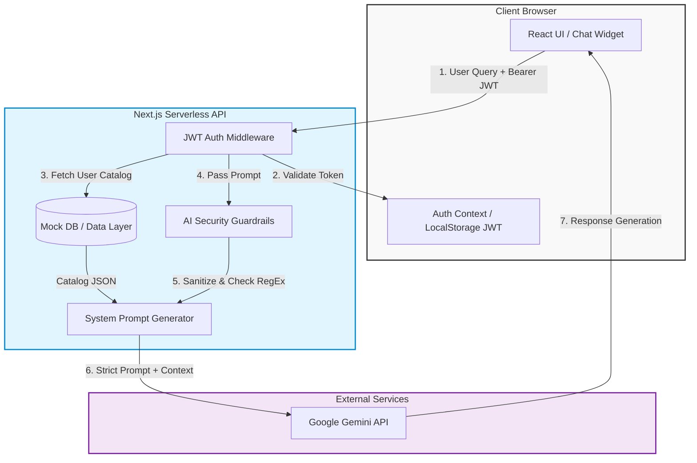

# 🤖 AI Agent Planning Document: SmartStore AI

## 1. Project Overview

### Website Topic and Purpose
**SmartStore AI** is an advanced e-commerce platform dedicated to high-end electronics, wearables, and smart home devices. The purpose of this platform is not just to list products, but to provide a secure, intelligent, and deeply personalized shopping experience. Moving away from traditional static catalogs, SmartStore creates an interactive environment where technology helps customers make informed purchasing decisions.

### Target Users
*   **Tech Enthusiasts & Professionals:** Users looking for detailed specifications, benchmarks, and deep-dive comparisons of hardware.
*   **Everyday Shoppers:** Users who need simplified, jargon-free advice on which product best fits their lifestyle or budget.
*   **Store Administrators:** Users who manage the product catalog and require secure isolation of proprietary data.

### Core Features of the Website
*   **Secure JWT Authentication:** Token-based, stateless authentication with expiration and tampering protection.
*   **Data Isolation:** Role-based access control where users only interact with data scoped to their permissions, preventing unauthorized data access.
*   **Dynamic Product Catalog:** Robust product listing with real-time categorizations, search, and multi-parameter sorting.
*   **Rich Product Details:** Comprehensive product pages featuring image galleries, tabbed specifications, and inline AI analysis.
*   **Responsive UI/UX:** Modern, glassmorphism-inspired dark theme optimized for all device sizes.

---

## 2. AI Agent Concept

### What problem will the AI agent solve?
In modern e-commerce, customers often suffer from "choice paralysis" and information overload. Comparing technical specifications across multiple tabs is tedious and confusing for non-technical users. Additionally, from a business perspective, exposing a customer service AI often leads to security risks like prompt injection, data exfiltration, or the AI recommending competitor products. 

The planned AI agent solves these problems by acting as an **expert, in-house store clerk** that can instantly distill complex specifications into personalized advice, while operating strictly within a fortified security boundary that protects both the user and the business.

### What type of agent will it be?
The AI will be a **Shopping Assistant & Technical Advisor**. It is highly specialized and context-aware—meaning it understands exactly what product the user is currently looking at and tailors its responses accordingly.

### How users will interact with the agent
1.  **Contextual Tab (Product Detail Page):** Users can switch to an "🤖 AI Analysis" tab on any product page. This section provides quick-action buttons (e.g., "What are the pros and cons?", "Is this worth the price?") for immediate, context-aware insights.
2.  **Global Floating Chatbot:** A persistent, collapsible chat widget available on all pages. Users can ask conversational questions, request comparisons across the catalog, or ask for recommendations based on specific needs (e.g., "I need a laptop for video editing under $1500").
3.  **Security-First Communication:** Under the hood, the user's input passes through strict sanitization and regex-based guardrails before reaching the LLM, ensuring the interaction remains safe and focused solely on the store's proprietary catalog.

---

## 3. System Architecture (High-Level)

The application utilizes a modern Serverless architecture to ensure the AI agent operates securely and efficiently.

### Frontend Interactions
*   Built with **Next.js (App Router)** and **React**.
*   The Chatbot UI and Product Detail pages send asynchronous HTTP POST requests containing user prompts and chat history to the backend API.
*   The frontend is responsible for rendering Markdown-formatted responses and managing the loading states (typing indicators).

### Backend Processing
*   The backend consists of **Next.js API Routes** running as serverless functions.
*   **Auth Middleware:** Validates JWT tokens to ensure only authorized users can query the AI, and fetches only the product data specific to that user.
*   **Security Layer (`ai-security.js`):** Intercepts the prompt and scans for over 30+ prompt injection patterns, SQL injection patterns, and competitor brand mentions.
*   **System Prompt Injection:** If the prompt is safe, the backend constructs a strict system instruction, appending the user-specific JSON product catalog as the AI's sole source of truth.

### External APIs
*   **Google Gemini API (Gemini 2.0 Flash):** Processes the sanitized prompts alongside the system instructions/catalog context, returning natural language insights strictly bound by the established security rules.

### Architecture Diagram

