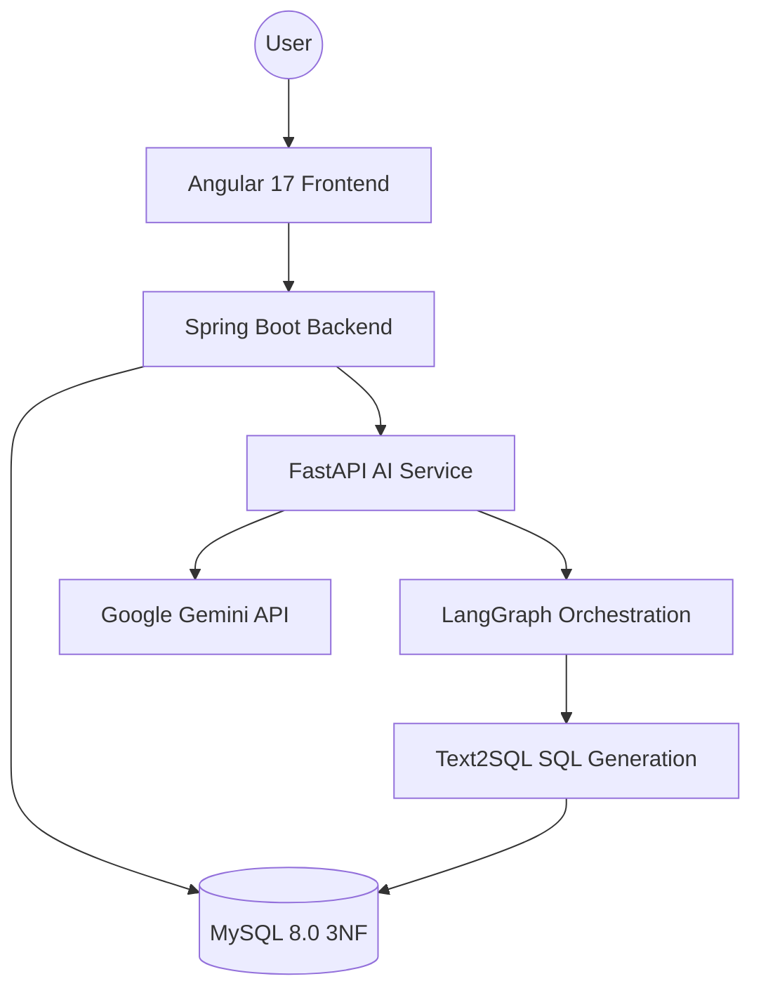

# 🚀 Project Reconstruction Roadmap: SmartStore AI 2026

This roadmap outlines the complete transformation of the current project into a professional-grade, enterprise-scale e-commerce platform that meets 100% of the requirements specified in the **Advanced Application Development 2026 Project** documentation.

## 🎯 Primary Objectives
1.  **Re-Platforming**: Move from Next.js to **Spring Boot (Backend)** and **Angular (Frontend)**.
2.  **Database Integrity**: Transition from static JSON files to a **MySQL (3NF)** relational database.
3.  **AI Intelligence**: Implement a **LangGraph-powered Text2SQL** agent system.
4.  **Real Data Integration**: Integrate and normalize datasets **DS4, DS5, and DS6**.

---

## 🛠️ Target Technology Stack

| Component | Technology | Role |
| :--- | :--- | :--- |
| **Backend** | Spring Boot 3.x (Java 17+) | Core Business Logic & API |
| **Frontend** | Angular 17+ | Client Interface & Dashboard |
| **Database** | MySQL 8.0 | Structured Data Storage (3NF) |
| **AI Service** | FastAPI (Python) | LangGraph & LLM Processing |
| **Security** | Spring Security + JWT | RBAC (Admin, Manager, Consumer) |
| **Orchestration** | LangGraph | Multi-agent AI Coordination |
| **Documentation** | Swagger / OpenAPI | API Specification |

---

## 🗺️ Implementation Phases

### Phase 1: Backend & Database Foundation (Weight: 25%)
> **Goal**: Establish the core infrastructure and data schema.

-  [ ] **Database Design (3NF)**:
    - Create normalized tables: `users`, `products`, `orders`, `order_items`, `reviews`, `inventory`.
    - Implement indexing for optimized search (Requirement DS1).
-  [ ] **Spring Boot Setup**:
    - Initialize project with Spring Web, Spring Data JPA, MySQL Driver.
    - Set up Hibernate Validator for backend validation.
-  [ ] **Security Layer**:
    - Implement Spring Security with JWT.
    - Define Role-Based Access Control: `ROLE_ADMIN`, `ROLE_MANAGER`, `ROLE_CONSUMER`.
-  [ ] **Core API Discovery**:
    - Integrate Swagger/OpenAPI for automated documentation.

### Phase 2: Data Engineering & ETL (Weight: 20%)
> **Goal**: Replace mock data with real-world electronics and e-commerce datasets.

-  [ ] **DS4 Integration**: Import Amazon E-Commerce Sales for inventory and order logic.
-  [ ] **DS5 Integration**: Process Pakistan E-Commerce data for regional logistics/pricing.
-  [ ] **DS6 Integration**: Import Amazon US Reviews for sentiment analysis tasks.
-  [ ] **ETL Pipeline**: Create automated scripts to clean and load data into MySQL.

### Phase 3: AI Agent & Text2SQL Core (Weight: 30%)
> **Goal**: Build the project's "Brain" using advanced AI orchestration.

-  [ ] **FastAPI AI Service**: Build a dedicated Python service for LLM tasks.
-  [ ] **LangGraph Workflow**:
    - **Query Agent**: Analyzes natural language input.
    - **SQL Agent**: Generates accurate SQL queries for MySQL.
    - **Response Agent**: Formats data and masks sensitive information (GDPR compliance).
-  [ ] **Context Injection**: Ensure the AI only accesses the current user's products/orders.

### Phase 4: Angular Frontend Development (Weight: 20%)
> **Goal**: Deliver a premium, high-performance user experience.

-  [ ] **Architecture**: Implement standalone components and service-based architecture.
-  [ ] **Admin Dashboard**: System health monitoring, User CRUD, and data logs.
-  [ ] **Manager Dashboard**: Statistical charts for regional inventory and product performance.
-  [ ] **Consumer Portal**: Product catalog, order history, and AI Chatbot interface.
-  [ ] **Real-time UX**: Integrate WebSockets or modern polling for AI chat interactions.

### Phase 5: Advanced Features & Final Compliance (Weight: 5%)
> **Goal**: Polish and documentation.

-  [ ] **Sentiment API**: Implement `GET /api/v1/products/{id}/reviews/sentiment` using NLP.
-  [ ] **Sales Analytics**: Build the sales dashboard backend aggregations.
-  [ ] **Testing**: Standardize JUnit tests for backend and Selenium/Protractor for frontend.

---

## 📈 Architecture Overview (Mermaid)

---

## 📝 Grading Rubric Checklist

- [ ] **Spring Boot / Java Project?** (Required)
- [ ] **Angular Project?** (Required)
- [ ] **MySQL/PostgreSQL Database?** (Required)
- [ ] **Text2SQL Chatbot?** (Critical - 30%)
- [ ] **LangGraph Orchestation?** (Required)
- [ ] **Integrated DS4, DS5, DS6?** (Required)
- [ ] **3 Roles (Admin, Manager, Consumer)?** (Required)
- [ ] **OpenAPI / Swagger Docs?** (Required)
